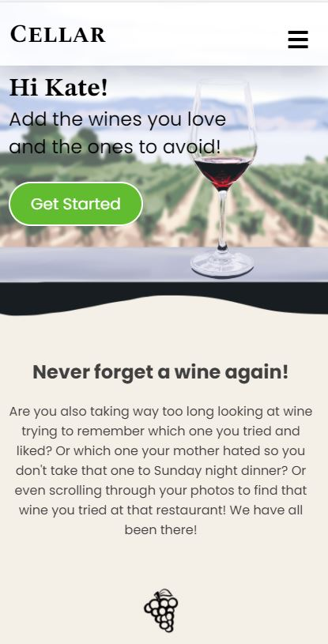
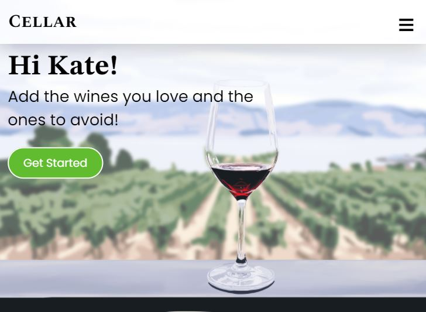

# Cellar

## Description
Cellar privately tracks the wines that you like and dislike, which helps you buy the wines you love and avoid the ones you don’t.

Cellar is your personal wine diary where you can upload photos, comment and rate the wines. With special features like geotags, cellar makes it easy to find your saved wines when you are in a rush at the liquor store.

### Live Link:

## Table of Contents
- [User Story](#user-story)
- [Installation](#installation)
- [Usage](#usage)
- [Results](#results)
- [Contribution](#contribution)
- [License](#license)
- [Questions](#questions)

## User Story
As an avid wine drinker,

I want to store my wine I have tried or like to try, privately,

I want to easily access my saved wines to help me save time deciding which wine to get at the liquor store.

So that I can start to branch out and try new wines that have fun labels

## Installation
npm install

## Usage

npm start

## Results

Mobile view of the home page:

Desktop view of the home page:

## License
MIT License

Copyright (c) 2021 Kate McColl

## Contribution
Open to contributions

## Questions
If you have any questions, please contact me by Email: kate@katemccollart.com GitHub: [katemccoll](https://github.com/katemccoll)
